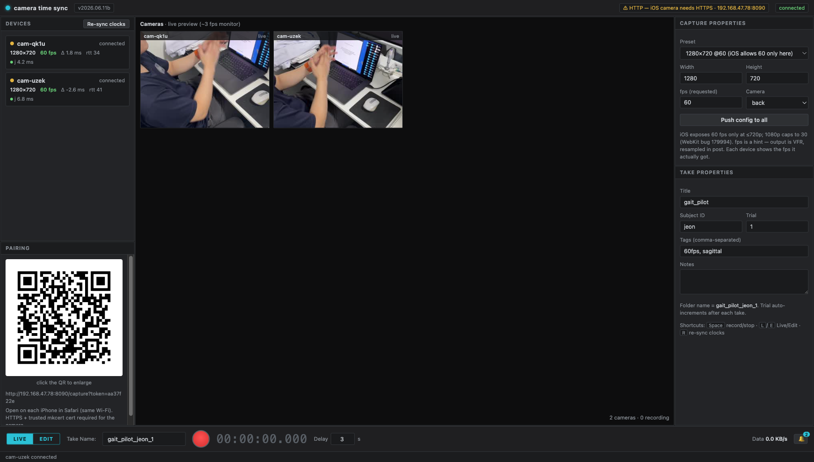

# Camera Time Sync (📷 xN)



Local, self-hosted app to record **time-synchronized video across multiple iPhones** from a browser, upload
the clips to a host computer, and align them in post for 2D pose estimation / 3D reconstruction.

The phones are ordinary iPhones running **Safari** (no native app to install). A small process on your
computer serves a control UI and a phone capture page over your local network, coordinates a synchronized
start and a shared clap, and aligns the recordings afterward. The approach mirrors
[OpenCap](https://www.opencap.ai/) (PLOS Comput Biol 2023): phones record independently and real
synchronization is recovered in **post-processing** — necessary because iOS Safari cannot expose per-frame
hardware timestamps, cannot lock frame rate, and stops recording on screen lock.

The host runs on **macOS, Linux, or Windows**. The phone side is identical everywhere; only the host setup,
the certificate-trust transfer, and the launcher differ — those steps below are split into **macOS / Linux**
and **Windows** subsections.

---

## Features

- **Motive-style control UI** — the control surface is laid out like OptiTrack Motive: a Devices pane
  (per-camera status, resolution, fps, clock offset/jitter, upload progress), a Cameras viewport with live
  previews and an on-screen countdown/CLAP cue, Capture & Take properties panes, and a bottom Control Deck
  with **LIVE | EDIT** modes, the take name, a record button, a running timecode, a configurable start
  **Delay**, a live **Data rate**, and an event log. Shortcuts: `Space` record/stop, `L`/`E` switch modes,
  `R` re-sync clocks.
- **Browser-only phone client** — pair an iPhone by scanning a QR code in Safari; no App Store, no profiles
  beyond a one-time local cert.
- **Synchronized trigger** — the host arms all phones to start at a shared future timestamp and prompts a clap.
- **Stale-host detection** — the host reports its version (`/health`, `/host`, WebSocket hello) and the UI
  warns when the running host predates the page (or vice versa).
- **Automatic sync + report on upload** — when every camera that recorded a session finishes uploading, the
  host runs the time-sync and builds that session's report automatically (toggleable). Or trigger it manually
  per recording with **Sync** / **Report** buttons.
- **Rich per-recording report** — inter-camera sync error vs the frame period, a **synchronized side-by-side
  player** of the aligned clips, the clap-detection diagnostic (audio envelopes + cross-correlation curve with
  a live playback cursor), a capture table, and an independent audio-vs-timestamp cross-check — all in the browser.
- **Post-hoc alignment** — audio-clap cross-correlation (primary) + per-frame timestamps (cross-check),
  resampled to a common constant frame rate (**your configured capture fps**) with ffmpeg.
- **Readable session folders** — named from your inputs as `title_subject_trial` (falls back to a timestamp).
- **OpenCap-compatible output** — for downstream 3D reconstruction in
  [opencap-core](https://github.com/stanfordnmbl/opencap-core) / [Pose2Sim](https://github.com/perfanalytics/pose2sim).
- **Minimal stack** — one aiohttp process, vanilla HTML/JS, filesystem only. No database, framework, or build step.

---

## Requirements

| Tool | Why | macOS / Linux | Windows |
|---|---|---|---|
| **Python 3.10+** | host process + analysis | [python.org](https://www.python.org/downloads/) · macOS `brew install python` | [python.org](https://www.python.org/downloads/) — tick **"Add python.exe to PATH"** |
| **ffmpeg / ffprobe** | audio extraction + VFR→CFR resampling | macOS `brew install ffmpeg` · Linux `apt install ffmpeg` | `winget install Gyan.FFmpeg` (add `bin` to PATH) |
| **mkcert** | locally-trusted HTTPS cert (iOS requires HTTPS for the camera) | macOS `brew install mkcert nss` | `winget install FiloSottile.mkcert` (or `choco install mkcert`) |
| iPhone(s) | the cameras | iOS Safari, on the **same Wi-Fi** as the host | iOS Safari, on the **same Wi-Fi** as the host |

After installing on Windows, open a **new** PowerShell window and confirm the tools are on PATH:
`python --version`, `ffmpeg -version`, `mkcert -version`.

---

## Install

```bash
git clone https://github.com/Juno31/time-sync.git
cd time-sync
```

**macOS / Linux:**

```bash
bash setup.sh          # creates .venv, installs Python deps, checks ffmpeg/mkcert
```

**Windows (PowerShell):**

```powershell
powershell -ExecutionPolicy Bypass -File setup.ps1
```

Both scripts create `.venv`, install the Python dependencies, and report whether `ffmpeg` and `mkcert` are
present. They are safe to re-run.

---

## One-time HTTPS cert (required — iOS blocks the camera over HTTP)

### 1. Trust the local CA on the host

```bash
mkcert -install                 # trust the local CA on this computer (macOS / Linux / Windows)
```

The host **auto-creates and refreshes** the TLS cert for your current LAN IP on startup (via `mkcert`), so
you never regenerate it by hand when your network changes.

### 2. Get the root CA onto each iPhone, then trust it (once per phone)

First locate the root certificate:

```bash
mkcert -CAROOT                  # prints a folder containing rootCA.pem
```

Transfer that **`rootCA.pem`** to the iPhone:

- **macOS:** AirDrop `rootCA.pem` to the iPhone.
- **Windows:** email it to yourself, or put it in OneDrive / iCloud Drive / Google Drive and open it in the
  Files app, or copy it over USB.

Then on the iPhone (identical on both platforms):

1. Open the `rootCA.pem` file → iOS says *Profile Downloaded*.
2. **Settings → General → VPN & Device Management** → tap the **mkcert** profile → **Install**.
3. **Settings → General → About → Certificate Trust Settings** → enable **full trust** for the mkcert root.

Without full trust, Safari blocks the camera and the capture page shows "Camera blocked".

### 3. iPhone capture settings — required for 60 fps

> **⚠️ Important:** On **each** iPhone, turn **off Auto FPS** before recording, or iOS will silently drop the
> camera to 30 fps in lower light and your 60 fps target won't be met.
>
> **Settings → Camera → Record Video → Auto FPS → Off**
>
> (On some iOS versions this appears as choosing a fixed rate such as "60 fps" instead of an "Auto" option.)
> Also record in adequate lighting — even with Auto FPS off, very low light can reduce the effective frame rate.

---

## Run

**macOS:** double-click **`start.command`** in Finder (first time: right-click → Open to clear Gatekeeper), or:

```bash
./run.sh                        # starts the host and opens the control UI
./run.sh --port 9000            # any app.py flags pass through
```

**Windows (PowerShell):**

```powershell
.\run.ps1                       # starts the host and opens the control UI
.\run.ps1 --port 9000           # any app.py flags pass through
```

If PowerShell blocks the script ("running scripts is disabled"), run it explicitly with
`powershell -ExecutionPolicy Bypass -File run.ps1`, or set the policy once:
`Set-ExecutionPolicy -Scope CurrentUser RemoteSigned`. Manual fallback on any OS:
`./.venv/bin/python app.py --open` (macOS/Linux) or `.\.venv\Scripts\python app.py --open` (Windows).

The launcher bootstraps the venv on first use, self-heals missing dependencies, and stops any stale instance
holding the port. The control UI opens at `https://<LAN-IP>:8443/`; its header shows host status
(🔒 HTTPS + LAN IP).

> **Windows firewall:** the first time the host binds the port, Windows may prompt to allow Python through
> the firewall — **allow it on Private networks**. If the phones can load the QR page but can't connect, add
> an inbound rule from an **Administrator** PowerShell (match the port to your `--port`):
> `New-NetFirewallRule -DisplayName "camera time sync" -Direction Inbound -Action Allow -Protocol TCP -LocalPort 8443`

### Record a trial

1. On each iPhone (same Wi-Fi), open Safari and **scan the QR** in the **Pairing** pane (click the QR to
   enlarge it for scanning from a distance) → **Allow camera & mic**.
   The phone appears in the **Devices** pane (clock offset/jitter, negotiated fps) and its live preview shows
   in the **Cameras** viewport (~3 fps monitor).
2. Set **Capture properties** → **Push config to all**. Fill in **Take properties** (Title / Subject / Trial —
   these name the folder, e.g. `gait_pilot_joonho_1`; a numeric Trial auto-increments after each take).
3. In the Control Deck (mode **LIVE**), press the **red record button** (or `Space`) — the viewport counts
   down, then prompts **CLAP**: clap once (sharp, single impulse) → press stop. The **Delay** field sets the
   synchronized-start lead time.
4. Clips upload automatically to `sessions/<title_subject_trial>/<camera>/` (per-camera progress shows in the
   Devices pane). Switch to **EDIT** to see the recordings & sync reports.

### The sync report

With **auto-sync + report after upload** enabled (default), the report is built automatically once all
cameras finish uploading. Otherwise, in the **EDIT** mode Data pane, click **Sync** then **Report**
(or just **Report**, which syncs on demand). The report includes a synchronized side-by-side player — press
Play and motion should line up across cameras — plus the residual-vs-frame-period verdict and the clap diagnostic.

> Tip: for the cleanest result, record **one isolated clap** with ~1 s of silence on either side. Multiple
> claps still align correctly (cross-correlation uses the whole pattern) but make the diagnostic noisier.
> Note the verdict is judged against your configured fps — at 60 fps one frame is 16.7 ms, a stricter bar than 30 fps.

---

## How it works

The shared time base is the host wall-clock (ms). Phones estimate their offset to it via an NTP-like
ping/pong over WebSocket. `MediaRecorder` output is variable-frame-rate, so `sync.py` recovers the true
inter-camera offset offline:

1. **Audio clap cross-correlation (primary)** — the single physical clap recorded by every phone's mic gives
   a sharp, sub-frame relative offset (uses the whole envelope pattern, so it is robust to echoes/multiple claps).
2. **Per-frame timestamps (independent cross-check / fallback)** — first server-clock stamp per camera from
   `frames.json`.
3. **Resample** — ffmpeg renders each clip to a common constant frame rate (your configured fps) with the claps
   coincident, using frame-accurate seeking and an identical frame count per clip.
4. **Verify** — re-measures the residual inter-camera offset on the aligned clips (the headline accuracy number).

See [`docs/sync_design.md`](docs/sync_design.md) for the exact algorithm, constants, and the
clap-position-vs-offset distinction.

Full design notes are in [`docs/`](docs/) and the rendered [`docs/app_documentation.html`](docs/app_documentation.html).

---

## Project structure

```
app.py                 aiohttp host: HTTPS pages + WebSocket hub + chunked upload
sync.py                offline post-hoc synchronization (clap x-corr + timestamps + ffmpeg)
calibrate.py           OpenCap-style camera calibration (checkerboard / reference object)
session_report.py      per-recording HTML report (sync verdict + clap diagnostic, inline SVG)
report.py              overall procedure report across all build steps
run.sh / start.command launcher, macOS/Linux (venv bootstrap + open UI)
run.ps1                launcher, Windows (PowerShell equivalent of run.sh)
setup.sh / setup.ps1   environment setup (bash / PowerShell)
requirements.txt       Python dependencies
web/control/           control UI (browser, on the host)
web/capture/           phone capture page (iOS Safari)
scripts/setup_certs.sh manual cert generation (usually unnecessary — host auto-refreshes)
tests/                 smoke.py (host), test_sync.py, test_calib.py, run_all.sh
docs/                  objectives, architecture, sync design, plan, decisions, running, error log
sessions/              recordings land here (git-ignored)
```

---

## Tests

No hardware needed. The combined runner starts its own throw-away host with `app.py --no-https`
(plain HTTP, no cert auto-creation) — that flag is also handy for quick local development; the iOS
camera will not work over HTTP.

**macOS / Linux:**

```bash
bash tests/run_all.sh          # host smoke + offline sync validation
python tests/test_calib.py     # calibration geometry validation
```

**Windows (PowerShell):** `run_all.sh` is bash-only; run the Python test files directly (or use Git Bash / WSL
for the combined runner):

```powershell
.\.venv\Scripts\python tests\smoke.py        # host smoke checks (run with the host stopped)
.\.venv\Scripts\python tests\test_sync.py    # offline sync validation
.\.venv\Scripts\python tests\test_calib.py   # calibration geometry validation
```

---

## Troubleshooting

- **iPhone camera won't detect the QR** — click the QR in the Pairing pane to open the enlarged
  version and scan that (small on-screen codes + glare are the usual cause). Requires host ≥ v2026.06.11b —
  older hosts served a clipped QR at small sizes.
- **Phones can't reach the host / QR page won't load** — campus / eduroam / guest Wi-Fi often blocks
  device-to-device traffic (client isolation). Use a home router, or turn on one iPhone's **Personal Hotspot**
  and connect the host + the other phone to it.
- **"Camera blocked" on the phone** — the mkcert cert isn't fully trusted on that phone (redo the trust steps)
  or the page was opened over `http`.
- **Recording stopped early** — keep the capture page in the foreground; a Wake Lock is requested
  automatically but iOS can still interrupt long sessions. On iPhone, also turn **off Low Power Mode**, which
  makes iOS deny the Wake Lock.
- **Report says "report engine unavailable"** — install the analysis deps on the host (`bash setup.sh` /
  `setup.ps1`, or `pip install -r requirements.txt`) and ensure `ffmpeg` is on PATH.

**Windows-specific:**

- **`python` / `ffmpeg` / `mkcert` "not recognized"** — not on PATH. Re-open PowerShell after installing, or
  re-run the installer with "Add to PATH" selected.
- **`run.ps1` won't execute ("running scripts is disabled")** — use
  `powershell -ExecutionPolicy Bypass -File run.ps1`, or `Set-ExecutionPolicy -Scope CurrentUser RemoteSigned`.
- **Phones load the QR page but can't connect** — Windows Firewall is blocking inbound traffic; add the rule
  shown under [Run](#run) and ensure the network profile is **Private**, not Public.
- **No 🔒 / serving HTTP** — `mkcert` isn't on PATH so the host couldn't make a cert. Install mkcert, run
  `mkcert -install`, and restart the launcher.

---

## Acknowledgements

Design and methodology reference [OpenCap](https://www.opencap.ai/) (Apache-2.0), with prior art also from
[Pose2Sim](https://github.com/perfanalytics/pose2sim) and Google's
[libsoftwaresync](https://github.com/google-research/libsoftwaresync). The control UI's look and layout are
inspired by [OptiTrack Motive](https://optitrack.com/software/motive/) 2.x (no OptiTrack assets are used).
This project is independent and not affiliated with those teams.

## License

[MIT](LICENSE) © 2026 Joonho
